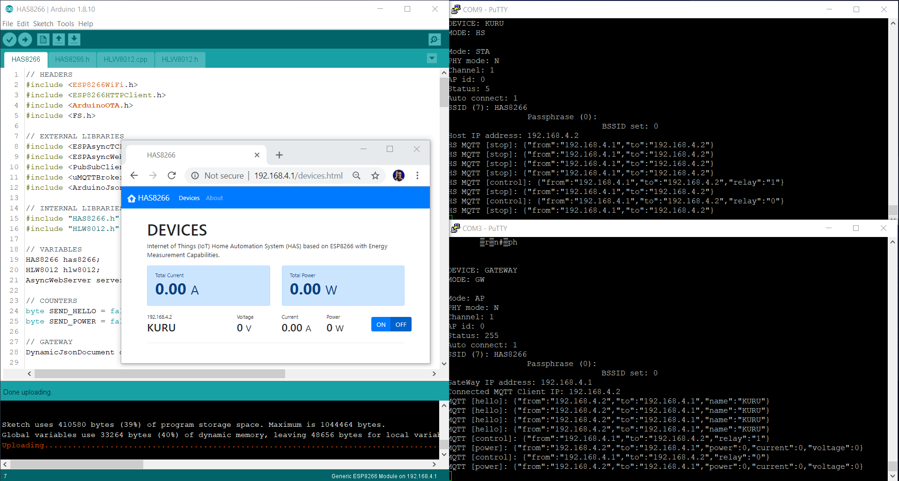
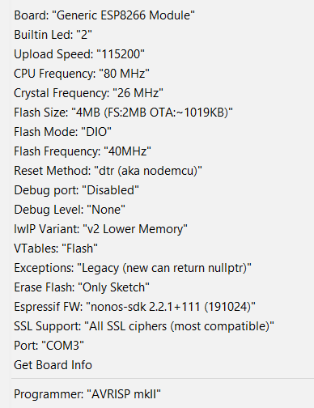

# LAS8266
Internet of Things (IoT) Laboratory Automation System (LAS) based on ESP8266 with Energy Measurement Capabilities.

### Information
The basic hardware components are the ESP8266 micro-controller by Espressif and energy meter chip HLW8012 by HLW Technology. The Software works over the TCP/IP stack and uses the MQTT protocol to communicate between the devices. The minimum configuration of the LAS includes one control device called Gateway and two or more manageable Host devices. The user friendly, simplified interface is web based. The platform has open software and hardware. 

### Authors
- Software: Dimitar Minchev, PhD of Informatics,  e-mail: <mitko@bfu.bg>
- Hardware: Atanas Dimitrov, PhD of Robots and manipulators, e-mail: <atanas@bfu.bg>

### Youtube Demo

### Hardware

### Software

# Arduino 
### Libraries
- [ESPAsyncTCP](https://github.com/me-no-dev/ESPAsyncTCP)
- [ESPAsyncWebServer](https://github.com/me-no-dev/ESPAsyncWebServer)
- [PubSubClient](https://github.com/knolleary/pubsubclient)
- [uMQTTBroker](https://github.com/martin-ger/uMQTTBroker)
- [ArduinoJson](https://github.com/bblanchon/ArduinoJson)

### Settings

The project is published as Open Source Hardware and Software.

