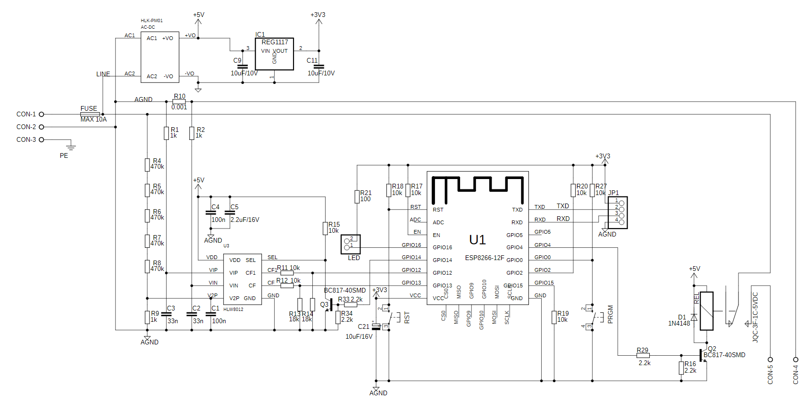

# Hardware
In this directory you will find all gerber files needed for manufacturing the pcb of the HAS8266.

## HAS8266 Schematic

## Gerber Files

## Software
For design of PCB we used Autodesk Eagle
https://www.autodesk.com/products/eagle/free-download
