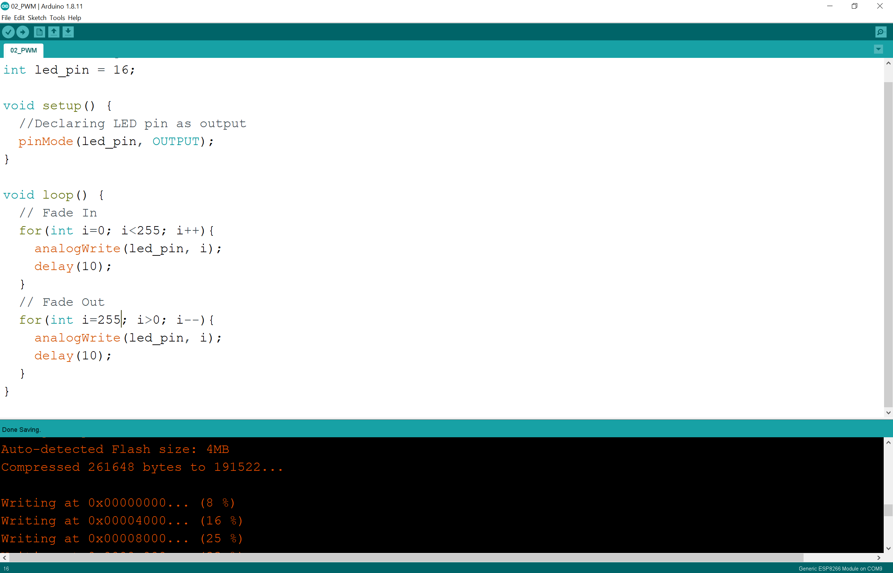

# PWM
Arduino Pulse Width Modulation:
https://www.arduino.cc/en/Tutorial/PWM

```
// Initializing LED Pin
int led_pin = 16;

void setup() {
  //Declaring LED pin as output
  pinMode(led_pin, OUTPUT);
}

void loop() {
  // Fade In
  for(int i=0; i<255; i++){
    analogWrite(led_pin, i);
    delay(10);
  }
  // Fade Out
  for(int i=255; i>0; i--){
    analogWrite(led_pin, i);
    delay(10);
  }
}
```
