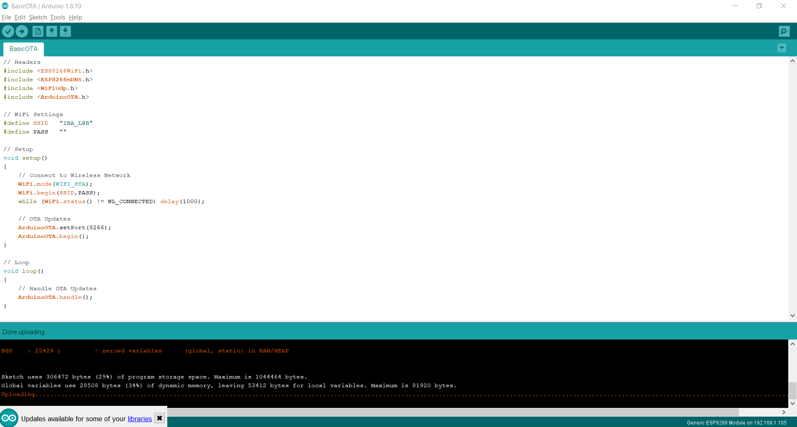
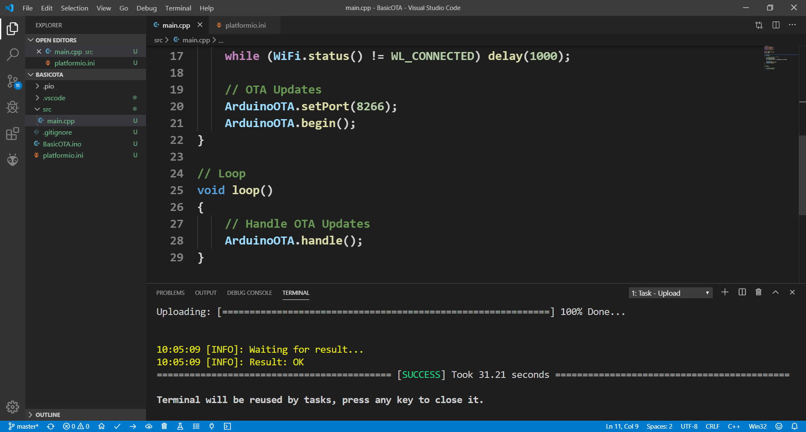

# OTA

## Arduino
```
// Headers
#include <ESP8266WiFi.h>
#include <ESP8266mDNS.h>
#include <WiFiUdp.h>
#include <ArduinoOTA.h>

// WiFi Settings
#define SSID   "IBA_L@B"
#define PASS   ""

// Setup
void setup() 
{  
    // Connect to Wireless Network
    WiFi.mode(WIFI_STA);
    WiFi.begin(SSID,PASS);
    while (WiFi.status() != WL_CONNECTED) delay(1000);

    // OTA Updates 
    ArduinoOTA.setPort(8266); 
    ArduinoOTA.begin();
}

// Loop
void loop() 
{
    // Handle OTA Updates
    ArduinoOTA.handle();
}
```


## PlatformIO
**platformio.ini**
```
; PlatformIO Project Configuration File

# ESP 8266 
[env:esp12e]
platform = espressif8266
board = esp12e
framework = arduino

# OTA 
upload_port = 192.168.1.105
upload_protocol = espota

# SERIAL 
; upload_port = COM3
; upload_speed = 115200
; monitor_speed = 115200
```
**main.cpp**
```
// Headers
#include <Arduino.h>
#include <ESP8266WiFi.h>
#include <WiFiUdp.h>
#include <ArduinoOTA.h>

// WiFi Settings
#define SSID   "IBA_L@B"
#define PASS   ""

// Setup
void setup() 
{  
    // Connect to Wireless Network
    WiFi.mode(WIFI_STA);
    WiFi.begin(SSID,PASS);
    while (WiFi.status() != WL_CONNECTED) delay(1000);

    // OTA Updates 
    ArduinoOTA.setPort(8266); 
    ArduinoOTA.begin();
}

// Loop
void loop() 
{
    // Handle OTA Updates
    ArduinoOTA.handle();
}
```
