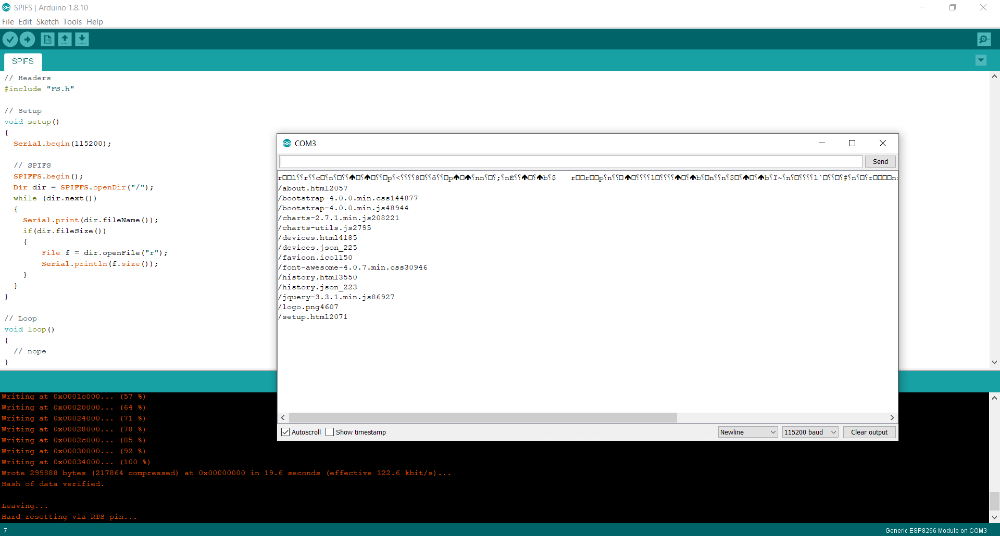
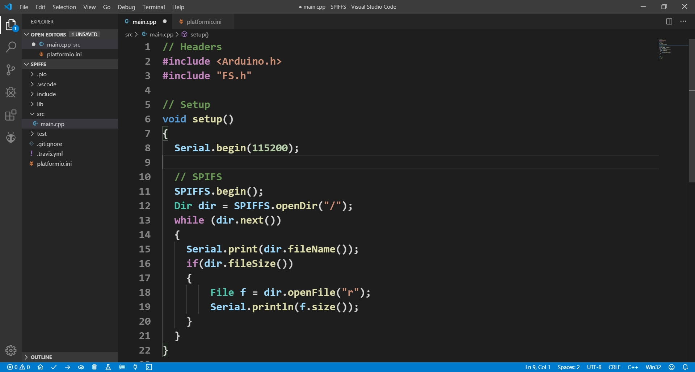

# SPIFFS
- [SPIFFS](https://arduino-esp8266.readthedocs.io/en/latest/filesystem.html#flash-layout)
- [Arduino ESP8266 FileSystem Uploader](https://github.com/esp8266/arduino-esp8266fs-plugin/releases)
- [Python](https://go.microsoft.com/fwlink?linkID=2082640) 


### Arduino
```
// Headers
#include "FS.h"

// Setup
void setup() 
{
  Serial.begin(115200);
  
  // SPIFS
  SPIFFS.begin();
  Dir dir = SPIFFS.openDir("/");
  while (dir.next()) 
  {
    Serial.print(dir.fileName());
    if(dir.fileSize()) 
    {
        File f = dir.openFile("r");
        Serial.println(f.size());
    }
  }
}

// Loop
void loop() 
{
  // nope
}
```



## PlatformIO
**platformio.ini**
```
; PlatformIO Project Configuration File

# ESP 8266 
[env:esp12e]
platform = espressif8266
board = esp12e
framework = arduino

# SERIAL 
upload_port = COM3
upload_speed = 115200
monitor_speed = 115200
```
**main.cpp**
```
// Headers
#include <Arduino.h>
#include "FS.h"

// Setup
void setup() 
{
  Serial.begin(115200);
  delay(2000);
  
  // SPIFS
  SPIFFS.begin();
  Dir dir = SPIFFS.openDir("/");
  while (dir.next()) 
  {
    Serial.print(dir.fileName());
    if(dir.fileSize()) 
    {
        File f = dir.openFile("r");
        Serial.println(f.size());
    }
  }
}

// Loop
void loop() 
{
  // nope
}
```

