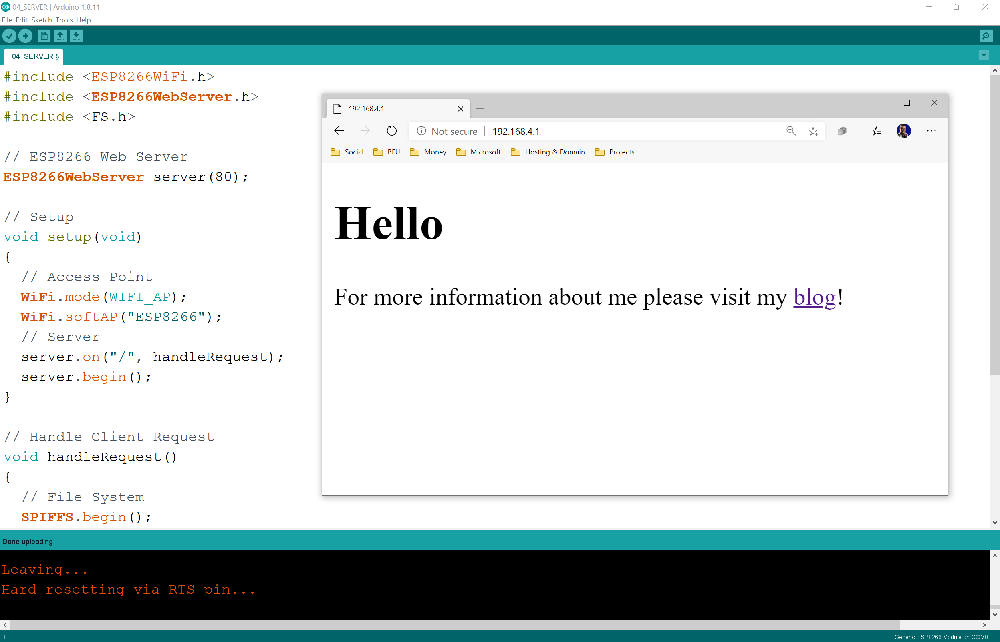

# Access Point and Web Server
Start ESP8266 as a Access Point and then serve Client requests as a Web Server.

### Arduino
```
#include <ESP8266WiFi.h>
#include <ESP8266WebServer.h>
#include <FS.h>

// ESP8266 Web Server
ESP8266WebServer server(80);

// Setup
void setup(void) 
{
  // Access Point
  WiFi.mode(WIFI_AP);
  WiFi.softAP("ESP8266");
  // Server
  server.on("/", handleRequest);
  server.begin();
}

// Handle Client Request
void handleRequest() 
{
  // File System
  SPIFFS.begin();
  File file = SPIFFS.open("/index.html", "r");
  server.send(200, "text/html", file.readString());
  file.close();
  // server.send(200, "text/plain", "Hello world");
}

// Loop
void loop(void) 
{
  server.handleClient();
}
```

