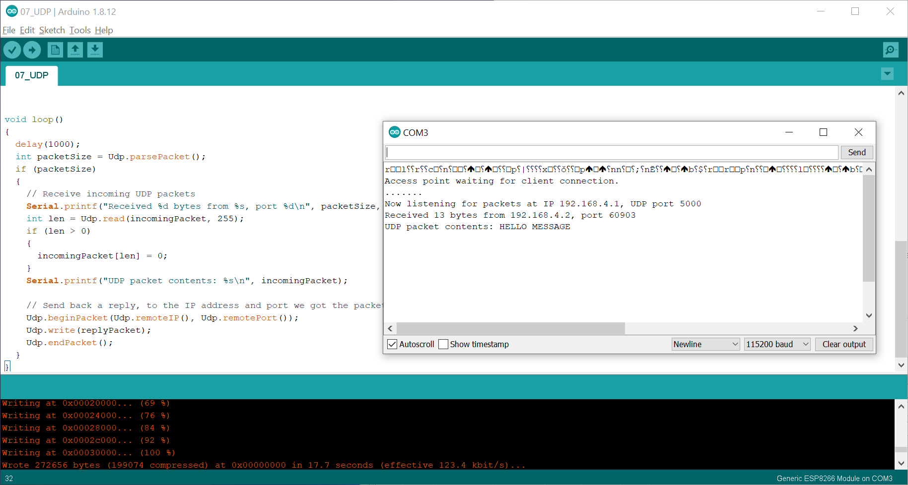
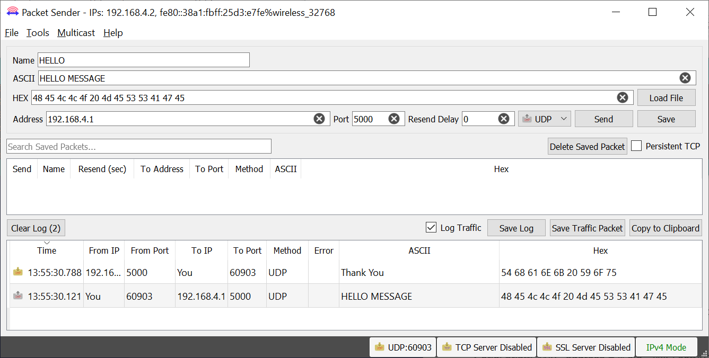

# UDP
- ESP8266 Arduino Core UDP Demo
https://arduino-esp8266.readthedocs.io/en/latest/esp8266wifi/udp-examples.html

- UDP Demo GitHub Repository
https://github.com/esp8266/Arduino/blob/master/doc/esp8266wifi/udp-examples.rst

### Arduino
```
#include <ESP8266WiFi.h>
#include <WiFiUdp.h>

WiFiUDP Udp;

unsigned int localUdpPort = 5000; // local port to listen on
char incomingPacket[255]; // buffer for incoming packets
char replyPacket[] = "Thank You"; // a reply string to send back

void setup()
{
  Serial.begin(115200);
  Serial.println();

  // Access Point
  Serial.println("Access point waiting for client connection.");
  WiFi.mode(WIFI_AP);
  while (WiFi.softAPgetStationNum()== 0)
  {
    delay(1000);
    Serial.print(".");
  }
  
  // Udp
  Udp.begin(localUdpPort);
  Serial.println();
  Serial.printf("Now listening for packets at IP %s, UDP port %d\n", WiFi.softAPIP().toString().c_str(), localUdpPort);
}


void loop()
{
  delay(1000);
  int packetSize = Udp.parsePacket();
  if (packetSize)
  {
    // Receive incoming UDP packets
    Serial.printf("Received %d bytes from %s, port %d\n", packetSize, Udp.remoteIP().toString().c_str(), Udp.remotePort());
    int len = Udp.read(incomingPacket, 255);
    if (len > 0)
    {
      incomingPacket[len] = 0;
    }
    Serial.printf("UDP packet contents: %s\n", incomingPacket);

    // Send back a reply, to the IP address and port we got the packet from
    Udp.beginPacket(Udp.remoteIP(), Udp.remotePort());
    Udp.write(replyPacket);
    Udp.endPacket();
  }
}
```


### Packet Sender
Packet Sender
https://packetsender.com/

