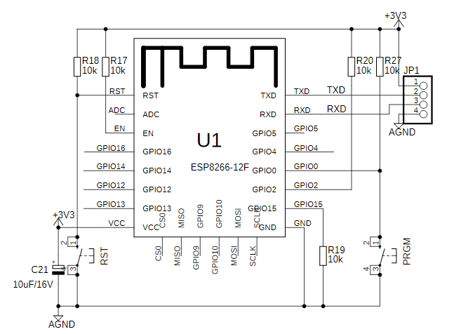
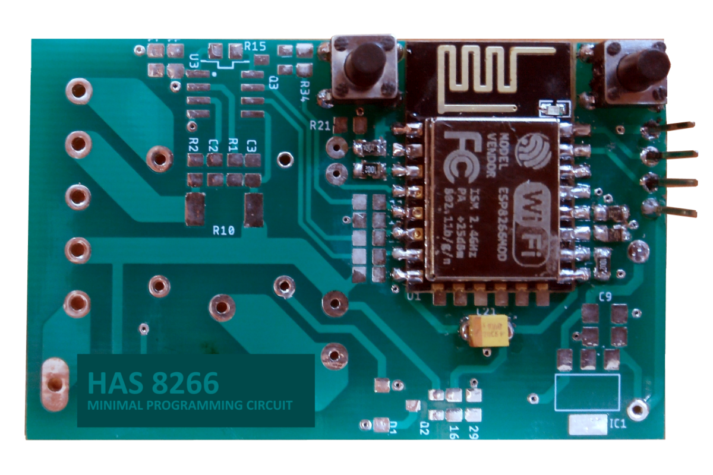
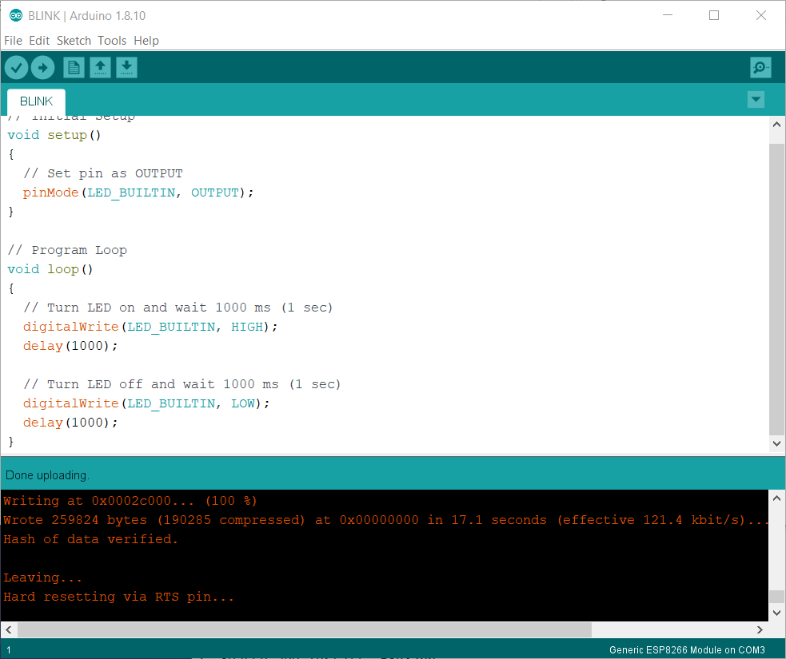

# BLINK

## INSTALL
Download and Install Arduino IDE
https://www.arduino.cc/en/Main/Software

## ESP8266
Install ESP8266 Add-on in Arduino IDE:

1. Arduino IDE
2. File > Preferences
3. Additional Boards Manager URLs:  http://arduino.esp8266.com/stable/package_esp8266com_index.json
4. Tools > Board > Boards Manager
5. Search and Install: **ESP8266**

## HARDWARE
Minimal Programming Schematics:


HAS8266 Device Ready to Program:


## SOFTWARE
```
// Initial Setup
void setup() 
{
  // Set pin as OUTPUT
  pinMode(LED_BUILTIN, OUTPUT); 
}

// Program Loop
void loop() 
{
  // Turn LED on and wait 1000 ms (1 sec)
  digitalWrite(LED_BUILTIN, HIGH); 
  delay(1000); 

  // Turn LED off and wait 1000 ms (1 sec)
  digitalWrite(LED_BUILTIN, LOW); 
  delay(1000); 
}
```
