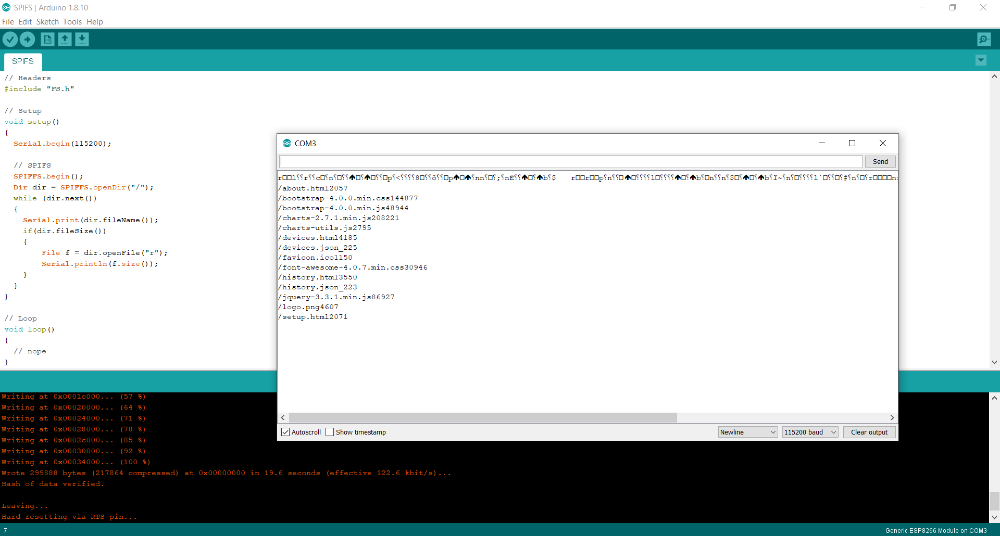

# SPIFS
What is [SPIFFS](https://arduino-esp8266.readthedocs.io/en/latest/filesystem.html#flash-layout)?

- [Arduino ESP8266 filesystem uploader](https://github.com/esp8266/arduino-esp8266fs-plugin/releases)
- Extract to: C:\Users\mitko\Documents\Arduino\tools\ESP8266FS\tool
- [Install Python](https://go.microsoft.com/fwlink?linkID=2082640) 
- Restart Arduino IDE

### Arduino
```
// Headers
#include "FS.h"

// Setup
void setup() 
{
  Serial.begin(115200);
  
  // SPIFS
  SPIFFS.begin();
  Dir dir = SPIFFS.openDir("/");
  while (dir.next()) 
  {
    Serial.print(dir.fileName());
    if(dir.fileSize()) 
    {
        File f = dir.openFile("r");
        Serial.println(f.size());
    }
  }
}

// Loop
void loop() 
{
  // nope
}
```


### PlatformIO