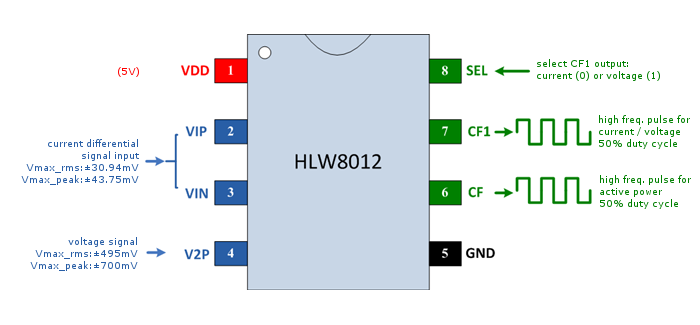

# HLW8012
HLW8012 library for Arduino and ESP8266 by Xose Perez
https://bitbucket.org/xoseperez/hlw8012/overview



This is the IC present in some chinese products like Itead's Sonoff POW. The HLW8012 is a current, voltage and power monitor IC that outputs a pulse of a frequency inversely proportional to the value to be read. This IC provides two PWM outputs, the first one for power and the second one for current or voltage, depending on the SEL pin. The output values are always RMS. Power measurements are very consistent but current or voltage measurements require a minimum time lapse after changing the SEL pin value to become stable. This fact reduces sampling frequency. Higher values (of power, current or voltage) mean shorter pulses.

Typical values are:
- A 1Hz pulse on CF pin means around 12W RMS
- A 1Hz pulse on CF1 pin means 15mA or 0.5V RMS depending on the value in SEL pin

These ratios are per datasheet typical application, but the actual circuitry might be different. Even if the circuit matches that on the datasheet the IC tolerances are quite loosy (+-15% for clock frequency, for instance).

### Features
The main features of the HLW8012 library are:
- Two available modes: interrupt-driven or non-interrupt-driven.
- Default calibration based on product datasheet (3.1 Typical Applications).
- You can specify the resistor values for your circuit.
- Optional manual calibration based on expected values.

### Usage
Check the examples for indications on how to use the library.

### Interrupt driven mode
When using interrupts, values are monitored in the background. When calling the get***() methods the last sampled value is returned, this value might be up to a few seconds old if they are very low values. This is specially obvious when switching off the load. The new value of 0W or 0mA is ideally represented by infinite-length pulses. That means that the interrupt is not triggered, the value does not get updated and it will only timeout after 2 seconds (configurable through the pulse_timeout parameter in the begin() method). During that time lapse the library will still return the last non-zero value.

### Non interrupt mode
On the other hand, when not using interrupts, you have to let some time for the pulses in CF1 to stabilize before reading the value. So after calling setMode or toggleMode leave 2 seconds minimum before calling the get methods. The get method for the current mode will measure the pulse width and return the corresponding value, the other one will return the cached value (or 0 if none).

Use non-interrupt approach and a low pulse_timeout (200ms) only if you are deploying a battery powered device and you care more about your device power consumption than about precission. But then you should know the HLW8012 takes about 15mW...

### Notes
I've put together this library after doing a lot of tests with a Sonoff POW2. The HLW8012 datasheet (in the "docs" folder) gives some information but I couldn't find any about this issue in the CF1 line that requires some time for the pulse length to stabilize (apparently). Any help about that will be very welcome.

### Manual calibration
Use a pure resistive load with a well-known power consumption or use a multimeter to monitor it. A bulb is usually a good idea, although a toaster would be better since it's power consumption is higher.

Then use the expected*() methods and feed the values. For instance, for a 60W bulb in a 230 line that would be:
```
hlw8012.expectedActivePower(60.0);
hlw8012.expectedVoltage(230.0);
hlw8012.expectedCurrent(60.0 / 230.0);
```