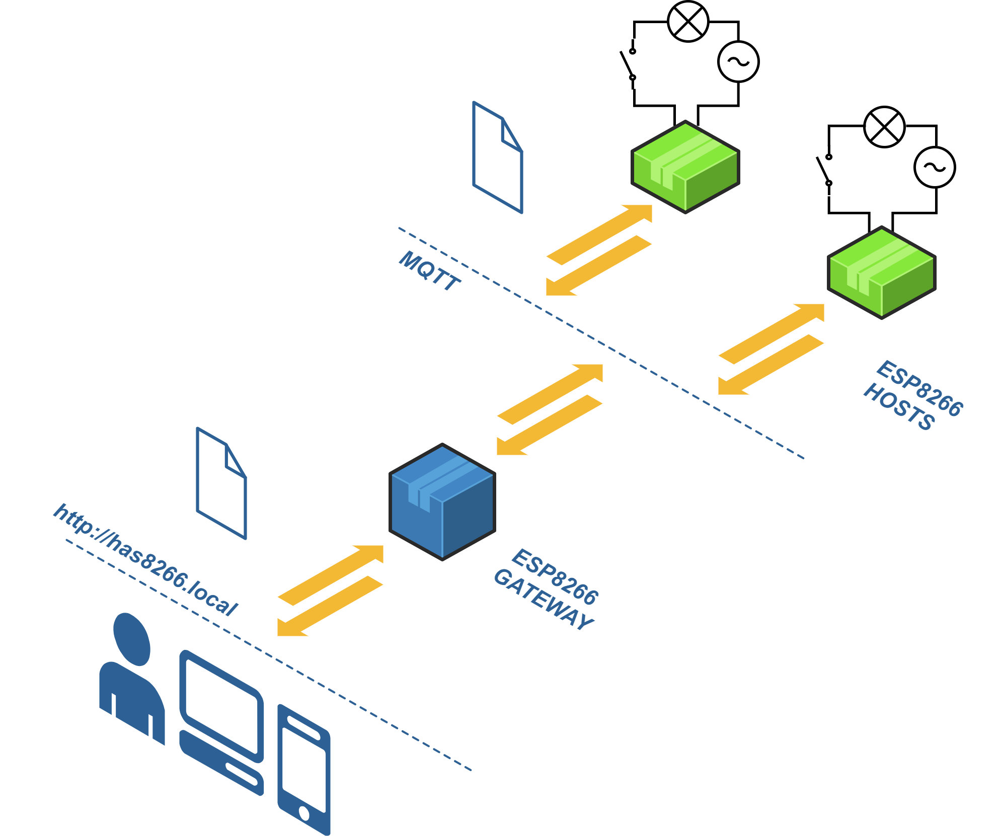
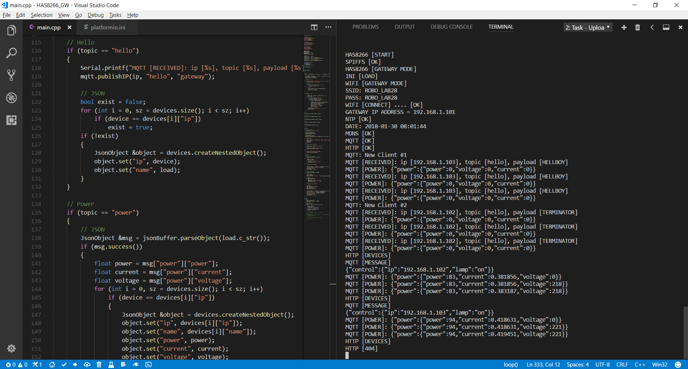
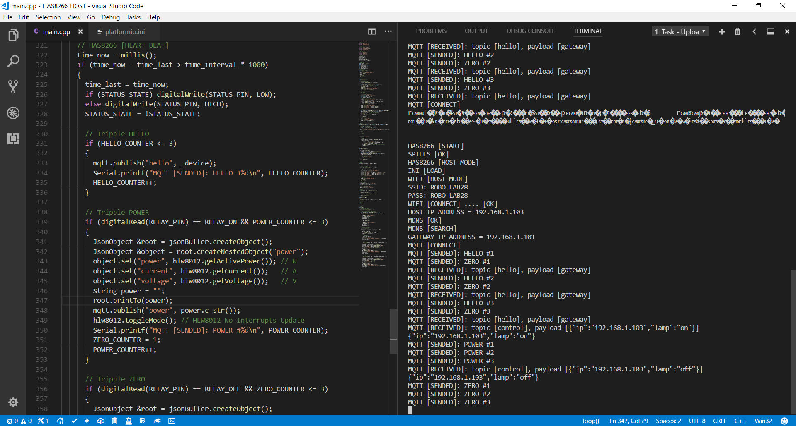
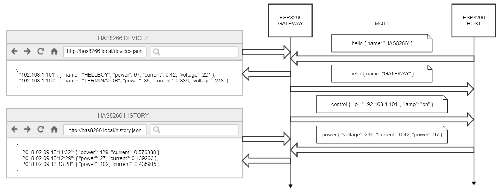
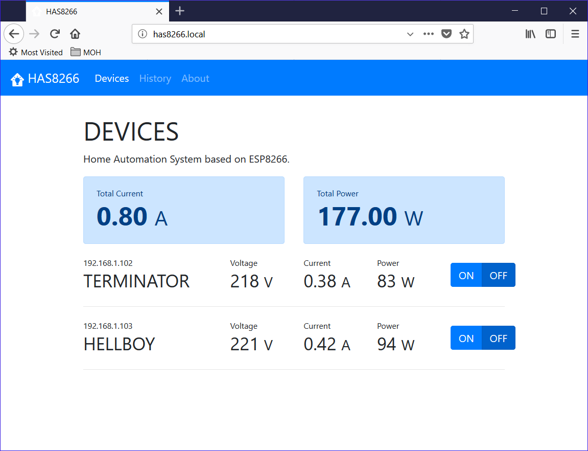

# Software
This folder contains the software part of the HAS8266 project.

## Architecture

## GateWay

## Host

## Cominication

## Web

## Requirements
- [Microsoft Visual Studio Code](http://code.visualstudio.com/download)
- [PlatformIO IDE for VSCode](http://platformio.org/platformio-ide)
