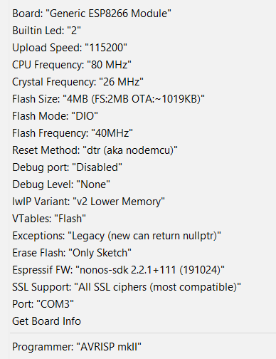

# HAS 8266
Internet of Things (IoT) Home Automation System (HAS) based on ESP8266 with Energy Measurement Capabilities.

## Arduino Libraries
- [ESPAsyncTCP](https://github.com/me-no-dev/ESPAsyncTCP)
- [ESPAsyncWebServer](https://github.com/me-no-dev/ESPAsyncWebServer)
- [PubSubClient](https://github.com/knolleary/pubsubclient)
- [uMQTTBroker](https://github.com/martin-ger/uMQTTBroker)
- [ArduinoJson](https://github.com/bblanchon/ArduinoJson)

## Arduino Settings

## Working Demo
